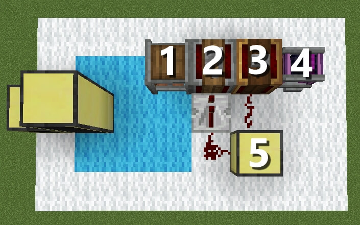
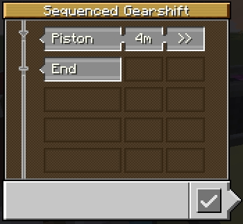
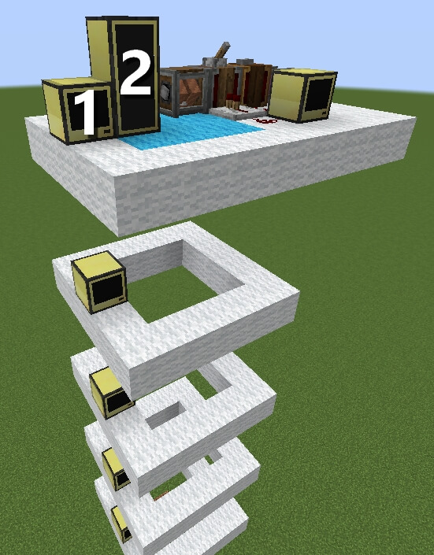

# Elevator
A small elevator script.

**THIS PROJECT IS NOT YET FINISHED!**

# Setup

- [1] Rope Pulley which will move the platform up and down. (Don't forget the glue connecting platform and monitor!)
- [2] Gearshift to handle the direction the platform is moving. If it is on, the platform will move down, if it's off, the platform will move up.
- [3] Sequenced Gearshift handles the distance between floors. In this case, 4m are 4 blocks between each floor. To move the elevator, the Sequenced Gearshift has to be powered by a single redstone impulse.

- [4] (Creative Motor) This should be replaced with your own source of energy.
- [5] Computer that acts as a server. Note the redstone connections, those should always be on the correct sides. The computer is facing towards the bottom of the image. (3 connects to the back of the server and 2 connects to the left side of the server.)

For testing purposes I would suggest to put a lever on the [2] Gearshift and a button on the [3] Sequenced Gearshift.

- [1] Computer that should be placed on each floor, next to where the monitors will be.
- [2] One or more monitors which are glued to the moving platform.