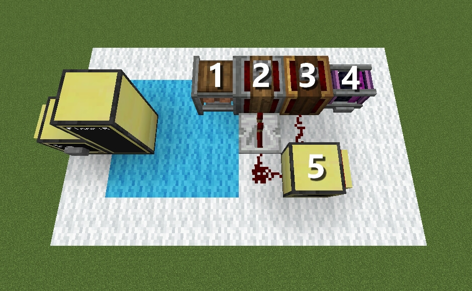
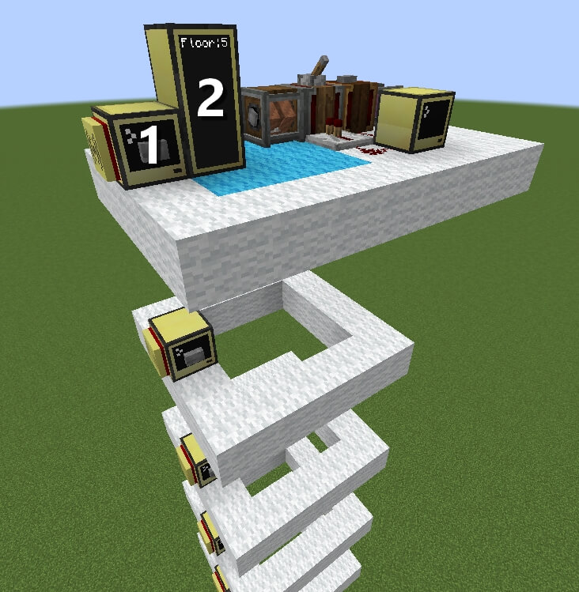

> [!WARNING]  
> This project is deprecated as the functionality is obsolete due to the _new-ish_ elevators in Create.

# Elevator
A small and simple elevator script.

    scm add elevator

**The UI for the monitor is not yet finished.**

**Requires Create and CC: Tweaked.**

## Setup

### Building

- [1] Rope Pulley which will move the platform up and down. (Don't forget the glue connecting platform and monitor!)
- [2] Gearshift to handle the direction the platform is moving. If it is on, the platform will move down, if it's off, the platform will move up.
- [3] Sequenced Gearshift handles the distance between floors. In this case, 4m are 4 blocks between each floor. To move the elevator, the Sequenced Gearshift has to be powered by a single redstone impulse.

- [4] (Creative Motor) This should be replaced with your own source of energy.
- [5] Computer that acts as a server and thus needs a modem. Note the redstone connections, those should always be on the correct sides. The computer is facing towards the bottom of the image. ([3] connects to the back of the server and [2] connects to the left side of the server.)

For testing purposes I would suggest to put a lever on the [2] Gearshift and a button on the [3] Sequenced Gearshift.

- [1] Computer that should be placed on each floor, next to where the monitors will be. Each computer requires a modem. Every Computer should have a button on it to call the elevator.
- [2] Two monitors which are glued to the moving platform.

    

### Programs
- First install [SCM](https://github.com/mc-cc-scripts/script-manager) on every computer with the following command: `pastebin run 1kKZ8zTS`
- Next install this script with `scm add elevator`.
#### Server
- On the server ([5] in image #1) run `elevator serve <server_name>`
#### Floors
- On every floor run the command `elevator floor <server_name> <floor_number>`.

That's it!

## Usage
You can now call the elevator to a floor by pressing the button on the computer.

To chose a destination you can click the desired floor on the monitor or type the floor into the computer.

# UI Libraries
The UI library can be changed within the config. You could even load it from a pastebin script!

For further documentation, please check the README.md in the [default UI library](https://github.com/mc-cc-scripts/elevatorDefaultUI-lib).
- [elevatorDefaultUI](https://github.com/mc-cc-scripts/elevatorDefaultUI-lib) - Default UI of the elevator
